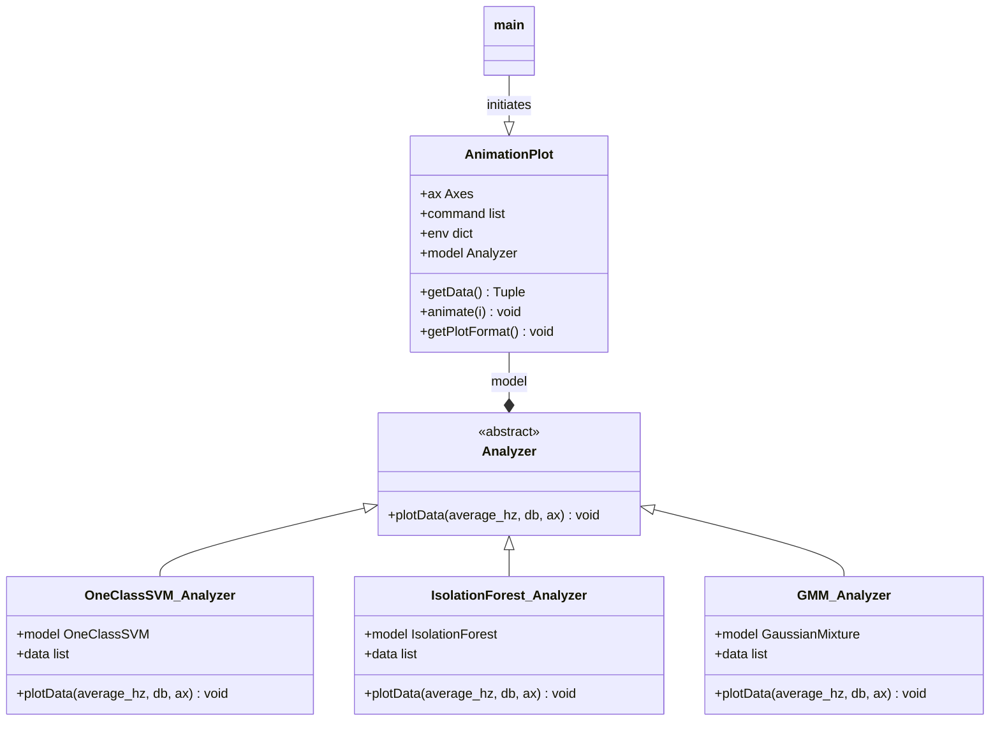

# Data Visualization Analyzers
This project is designed to facilitate real-time data visualization by utilizing different analyzers. Each analyzer implements a specific algorithm for analyzing and visualizing signal data captured from various sources.

## Getting Started
To get started with creating a new analyzer, ensure you have a development environment set up with Python 3.8+, matplotlib, numpy, and scikit-learn.

Prerequisites
- Python 3.8+
- matplotlib
- numpy
- cikit-learn
You can install the required packages using pip:
```
pip install matplotlib numpy scikit-learn
```

## Architecture Overview
The project is structured around a core set of classes designed to facilitate real-time data visualization through various analysis techniques. Below is an overview of the main components and their relationships:

- **Analyzer (Abstract Base Class)**: Serves as a template for all analyzers. Each analyzer must implement the plotData method, defining how data should be visualized.

- **Concrete Analyzers**: Implementations of the Analyzer class, each providing a unique way of analyzing and visualizing data. Examples include OneClassSVM_Analyzer, IsolationForest_Analyzer, and GMM_Analyzer.

- **AnimationPlot**: Manages the animation and plotting process. It is initialized with a matplotlib.axes.Axes object and an optional analyzer for advanced plotting capabilities.

### Class Diagram
Below is a simplified class diagram that illustrates the relationships between the main components:


## Writing a New Analyzer
To create a new analyzer, follow these steps:

1) Inherit from the Analyzer Abstract Base Class: Your new analyzer must inherit from the Analyzer abstract base class and implement the plotData method.

2) Implement the plotData Method: This method takes frequency data (average_hz), decibel values (db), and a matplotlib.axes.Axes object (ax) to plot the analyzed data.

## Example Analyzer
Below is a template for creating a new analyzer:

```
from Analyzer import Analyzer
from matplotlib.axes import Axes
import numpy as np

class YourAnalyzer(Analyzer):
    def __init__(self):
        # Initialize your model and any other necessary attributes here
        pass

    def plotData(self, average_hz, db, ax: Axes) -> None:
        # Convert your data into a suitable format for analysis and plotting
        data = [[hz, db_val] for hz, db_val in zip(average_hz, db)]
        X = np.array(data)
        
        # Perform your analysis on X
        # For example, model.fit(X)
        
        # Plot your analyzed data on the given Axes object (ax)
        ax.scatter(X[:, 0], X[:, 1], s=1, alpha=0.5)
        # Further customize your plot as needed
        ax.legend(['Your Data Label'])
```

## Integrating Your Analyzer
After creating your analyzer, you can integrate it with the AnimationPlot class by passing an instance of your analyzer to its constructor. For example:

```
from matplotlib import pyplot as plt
import matplotlib.animation as animation
from animator import AnimationPlot
from your_analyzer import YourAnalyzer

def main():
    fig, ax = plt.subplots()
    analyzer = YourAnalyzer()  # Instantiate your analyzer
    realTimePlot = AnimationPlot(ax, analyzer)
    ani = animation.FuncAnimation(fig, realTimePlot.animate, frames=100, interval=100)
    plt.show()

if __name__ == "__main__":
    main()
```
